<body class="jp-Notebook" data-jp-theme-light="true" data-jp-theme-name="JupyterLab Light">
<main>

<h4 id="Model-comparisons-with-audio-examples">Model comparisons with audio examples<a class="anchor-link" href="#Model-comparisons-with-audio-examples">¶</a></h4>
Here we compare selected audio examples for the scenarios: matched DNS with no reverberation, mismatched VoiceBank+DEMAND training to DNS with no reverberation testing, and mismatched DNS training to VoiceBank+DEMAND testing.

We selected two examples for speech-like noise, specifically babble noise with a male and a female target speaker, and two non-speech noise types from the DNS test set. From the VoiceBank+DEMAND corpus, we chose a male speaker with musical noise and a female speaker with babble noise. Our aim was to choose files with a noisy mixture SNR of approximately 5 dB. However, the selection of non-speech noise examples was constrained by the inherent randomness of the noise distribution within our test sets, specifically for the VoiceBank+DEMAND corpus.

In [25]:

<pre>from IPython.display import Image, display, HTML, Audio

def create_html_display(image_path, clean_path, noisy_path, denoised_path, image_title):
    # Titles for the audio files and image
    audio_title_1 = 'De-noised audio'
    audio_title_2 = 'Noisy audio'
    audio_title_3 = 'Clean audio'

    image_width = "1200px"
    image_height = "auto"
    # Create HTML to display the image and audio files in a column with titles
    html_content = f"""
    &lt;div style="display: flex;"&gt;
        &lt;div style="margin-right: 20px;"&gt;
            &lt;div style="margin-top: 100px;"&gt;
                &lt;p&gt;{audio_title_1}&lt;/p&gt;
                &lt;audio controls&gt;
                    &lt;source src="{denoised_path}" type="audio/mpeg"&gt;
                    Your browser does not support the audio element.
                &lt;/audio&gt;
            &lt;/div&gt;
            &lt;div style="margin-top: 50px;"&gt;
                &lt;p&gt;{audio_title_2}&lt;/p&gt;
                &lt;audio controls&gt;
                    &lt;source src="{noisy_path}" type="audio/mpeg"&gt;
                    Your browser does not support the audio element.
                &lt;/audio&gt;
            &lt;/div&gt;
            &lt;div style="margin-top: 50px;"&gt;
                &lt;p&gt;{audio_title_3}&lt;/p&gt;
                &lt;audio controls&gt;
                    &lt;source src="{clean_path}" type="audio/mpeg"&gt;
                    Your browser does not support the audio element.
                &lt;/audio&gt;
            &lt;/div&gt;
        &lt;/div&gt;
        &lt;div&gt;
            &lt;p style="font-size: 24px;"&gt;{image_title}&lt;/p&gt;
            &lt;img src="{image_path}" alt="Image" style="width: {image_width}; height: {image_height};"&gt;
        &lt;/div&gt;
    &lt;/div&gt;
    """

    # Display the audio files using HTML
    display(HTML(html_content))
</pre>

<h4 id="Comparing-CU-Net-with-the-CVU-Net-for-Magnitude/Phase-features-in-the-matched-DNS-no-reverberation-scenario">Comparing CU-Net with the CVU-Net for Magnitude/Phase features in the matched DNS-no reverberation scenario<a class="anchor-link" href="#Comparing-CU-Net-with-the-CVU-Net-for-Magnitude/Phase-features-in-the-matched-DNS-no-reverberation-scenario">¶</a></h4>
Three different audio files are chosen for this comparison. One male and one female speaker scenarios with babble noise and one female speaker with non-stationary noise (wind).

In [26]:

<pre># Wind noise
# CU-Net
image_path = "audio_examples/dns-norev/cunet-maph/cunet-maph_fileid_170.png"
clean_path = "audio_examples/voice-dns-norev/clean_clnsp205_wind_407027_1_snr1_tl-24_fileid_170.wav"
noisy_path = "audio_examples/dns-norev/noisy_fileid_170.wav"
denoised_path = "audio_examples/dns-norev/cunet-maph/clnsp205_wind_407027_1_snr1_tl-24_fileid_170.wav"
image_title = "Example of the CU-Net (Ma/Ph) de-noising on wind noise with a male speaker"
create_html_display(image_path, clean_path, noisy_path, denoised_path, image_title)

# CVU-Net
image_path = "audio_examples/dns-norev/cvunet-maph/cvunet-maph_fileid_170.png"
clean_path = "audio_examples/voice-dns-norev/clean_clnsp205_wind_407027_1_snr1_tl-24_fileid_170.wav"
noisy_path = "audio_examples/dns-norev/noisy_fileid_170.wav"
denoised_path = "audio_examples/dns-norev/cvunet-maph/clnsp205_wind_407027_1_snr1_tl-24_fileid_170.wav"
image_title = "Example of the CVU-Net (Ma/Ph) de-noising on wind noise with a male speaker"
create_html_display(image_path, clean_path, noisy_path, denoised_path, image_title)

# Vacuum noise female speaker
# CU-Net
image_path = "audio_examples/dns-norev/cunet-maph/cunet-maph_fileid_175.png"
clean_path = "audio_examples/voice-dns-norev/clean_clnsp257_vacuum_273194_2_snr4_tl-18_fileid_175.wav"
noisy_path = "audio_examples/dns-norev/noisy_fileid_175.wav"
denoised_path = "audio_examples/dns-norev/cunet-maph/clnsp257_vacuum_273194_2_snr4_tl-18_fileid_175.wav"
image_title = "Example of the CU-Net (Ma/Ph) de-noising a vacuum cleaner noise with a female speaker"
create_html_display(image_path, clean_path, noisy_path, denoised_path, image_title)

# CVU-Net
image_path = "audio_examples/dns-norev/cvunet-maph/cvunet-maph_fileid_175.png"
denoised_path = denoised_path = "audio_examples/dns-norev/cvunet-maph/clnsp257_vacuum_273194_2_snr4_tl-18_fileid_175.wav"
image_title = "Example of the CVU-Net (Ma/Ph) de-noising a vacuum cleaner noise with a female speaker"
create_html_display(image_path, clean_path, noisy_path, denoised_path, image_title)

# Babble male speaker
# CU-Net
image_path = "audio_examples/dns-norev/cunet-maph/cunet-maph_fileid_255.png"
clean_path = "audio_examples/voice-dns-norev/clean_clnsp50_babble_188218_24_snr4_tl-29_fileid_255.wav"
noisy_path = "audio_examples/dns-norev/noisy_fileid_255.wav"
denoised_path = "audio_examples/dns-norev/cunet-maph/clnsp50_babble_188218_24_snr4_tl-29_fileid_255.wav"
image_title = "Example of the CU-Net (Ma/Ph) de-noising on babble noise with a male speaker"
create_html_display(image_path, clean_path, noisy_path, denoised_path, image_title)

# CVU-Net
image_path = "audio_examples/dns-norev/cvunet-maph/cvunet-maph_fileid_255.png"
clean_path = "audio_examples/voice-dns-norev/clean_clnsp50_babble_188218_24_snr4_tl-29_fileid_255.wav"
noisy_path = "audio_examples/dns-norev/noisy_fileid_255.wav"
denoised_path = "audio_examples/dns-norev/cvunet-maph/clnsp50_babble_188218_24_snr4_tl-29_fileid_255.wav"
image_title = "Example of the CVU-Net (Ma/Ph) de-noising on babble noise with a male speaker"
create_html_display(image_path, clean_path, noisy_path, denoised_path, image_title)

# Babble Female speaker
# CU-Net
image_path = "audio_examples/dns-norev/cunet-maph/cunet-maph_fileid_147.png"
clean_path = "audio_examples/voice-dns-norev/clean_clnsp25_babble_188218_21_snr5_tl-25_fileid_147.wav"
noisy_path = "audio_examples/dns-norev/noisy_fileid_147.wav"
denoised_path = "audio_examples/dns-norev/cunet-maph/clnsp25_babble_188218_21_snr5_tl-25_fileid_147.wav"
image_title = "Example of the CU-Net (Ma/Ph) de-noising on babble noise with a female speaker"
create_html_display(image_path, clean_path, noisy_path, denoised_path, image_title)

# CVU-Net
image_path = "audio_examples/dns-norev/cvunet-maph/cvunet-maph_fileid_147.png"
clean_path = "audio_examples/voice-dns-norev/clean_clnsp25_babble_188218_21_snr5_tl-25_fileid_147.wav"
noisy_path = "audio_examples/dns-norev/noisy_fileid_147.wav"
denoised_path = "audio_examples/dns-norev/cvunet-maph/clnsp25_babble_188218_21_snr5_tl-25_fileid_147.wav"
image_title = "Example of the CVU-Net (Ma/Ph) de-noising on babble noise with a female speaker"
create_html_display(image_path, clean_path, noisy_path, denoised_path, image_title)
</pre>

De-noised audio

<audio controls="">
<source src="audio_examples/dns-norev/cunet-maph/clnsp205_wind_407027_1_snr1_tl-24_fileid_170.wav" type="audio/mpeg"/>
                    Your browser does not support the audio element.
                </audio>

Noisy audio

<audio controls="">
<source src="audio_examples/dns-norev/noisy_fileid_170.wav" type="audio/mpeg"/>
                    Your browser does not support the audio element.
                </audio>

Clean audio

<audio controls="">
<source src="audio_examples/voice-dns-norev/clean_clnsp205_wind_407027_1_snr1_tl-24_fileid_170.wav" type="audio/mpeg"/>
                    Your browser does not support the audio element.
                </audio>

Example of the CU-Net (Ma/Ph) de-noising on wind noise with a male speaker

De-noised audio

<audio controls="">
<source src="audio_examples/dns-norev/cvunet-maph/clnsp205_wind_407027_1_snr1_tl-24_fileid_170.wav" type="audio/mpeg"/>
                    Your browser does not support the audio element.
                </audio>

Noisy audio

<audio controls="">
<source src="audio_examples/dns-norev/noisy_fileid_170.wav" type="audio/mpeg"/>
                    Your browser does not support the audio element.
                </audio>

Clean audio

<audio controls="">
<source src="audio_examples/voice-dns-norev/clean_clnsp205_wind_407027_1_snr1_tl-24_fileid_170.wav" type="audio/mpeg"/>
                    Your browser does not support the audio element.
                </audio>

Example of the CVU-Net (Ma/Ph) de-noising on wind noise with a male speaker

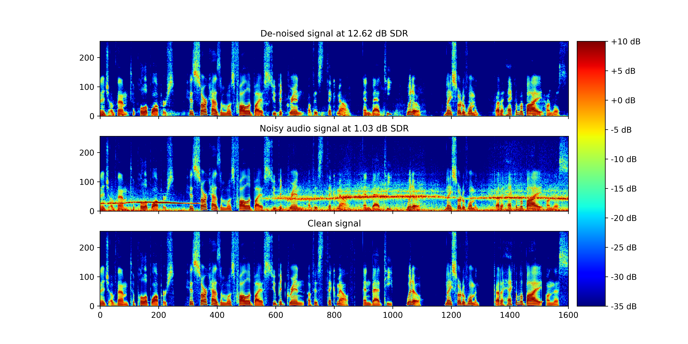

De-noised audio

<audio controls="">
<source src="audio_examples/dns-norev/cunet-maph/clnsp257_vacuum_273194_2_snr4_tl-18_fileid_175.wav" type="audio/mpeg"/>
                    Your browser does not support the audio element.
                </audio>

Noisy audio

<audio controls="">
<source src="audio_examples/dns-norev/noisy_fileid_175.wav" type="audio/mpeg"/>
                    Your browser does not support the audio element.
                </audio>

Clean audio

<audio controls="">
<source src="audio_examples/voice-dns-norev/clean_clnsp257_vacuum_273194_2_snr4_tl-18_fileid_175.wav" type="audio/mpeg"/>
                    Your browser does not support the audio element.
                </audio>

Example of the CU-Net (Ma/Ph) de-noising a vacuum cleaner noise with a female speaker

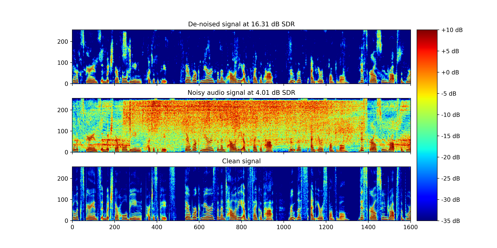

De-noised audio

<audio controls="">
<source src="audio_examples/dns-norev/cvunet-maph/clnsp257_vacuum_273194_2_snr4_tl-18_fileid_175.wav" type="audio/mpeg"/>
                    Your browser does not support the audio element.
                </audio>

Noisy audio

<audio controls="">
<source src="audio_examples/dns-norev/noisy_fileid_175.wav" type="audio/mpeg"/>
                    Your browser does not support the audio element.
                </audio>

Clean audio

<audio controls="">
<source src="audio_examples/voice-dns-norev/clean_clnsp257_vacuum_273194_2_snr4_tl-18_fileid_175.wav" type="audio/mpeg"/>
                    Your browser does not support the audio element.
                </audio>

Example of the CVU-Net (Ma/Ph) de-noising a vacuum cleaner noise with a female speaker

De-noised audio

<audio controls="">
<source src="audio_examples/dns-norev/cunet-maph/clnsp50_babble_188218_24_snr4_tl-29_fileid_255.wav" type="audio/mpeg"/>
                    Your browser does not support the audio element.
                </audio>

Noisy audio

<audio controls="">
<source src="audio_examples/dns-norev/noisy_fileid_255.wav" type="audio/mpeg"/>
                    Your browser does not support the audio element.
                </audio>

Clean audio

<audio controls="">
<source src="audio_examples/voice-dns-norev/clean_clnsp50_babble_188218_24_snr4_tl-29_fileid_255.wav" type="audio/mpeg"/>
                    Your browser does not support the audio element.
                </audio>

Example of the CU-Net (Ma/Ph) de-noising on babble noise with a male speaker

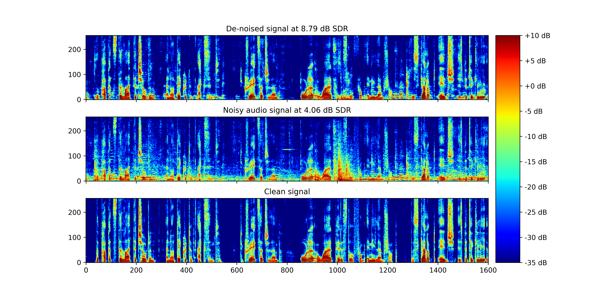

De-noised audio

<audio controls="">
<source src="audio_examples/dns-norev/cvunet-maph/clnsp50_babble_188218_24_snr4_tl-29_fileid_255.wav" type="audio/mpeg"/>
                    Your browser does not support the audio element.
                </audio>

Noisy audio

<audio controls="">
<source src="audio_examples/dns-norev/noisy_fileid_255.wav" type="audio/mpeg"/>
                    Your browser does not support the audio element.
                </audio>

Clean audio

<audio controls="">
<source src="audio_examples/voice-dns-norev/clean_clnsp50_babble_188218_24_snr4_tl-29_fileid_255.wav" type="audio/mpeg"/>
                    Your browser does not support the audio element.
                </audio>

Example of the CVU-Net (Ma/Ph) de-noising on babble noise with a male speaker

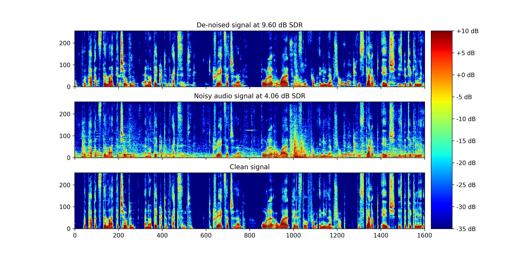

De-noised audio

<audio controls="">
<source src="audio_examples/dns-norev/cunet-maph/clnsp25_babble_188218_21_snr5_tl-25_fileid_147.wav" type="audio/mpeg"/>
                    Your browser does not support the audio element.
                </audio>

Noisy audio

<audio controls="">
<source src="audio_examples/dns-norev/noisy_fileid_147.wav" type="audio/mpeg"/>
                    Your browser does not support the audio element.
                </audio>

Clean audio

<audio controls="">
<source src="audio_examples/voice-dns-norev/clean_clnsp25_babble_188218_21_snr5_tl-25_fileid_147.wav" type="audio/mpeg"/>
                    Your browser does not support the audio element.
                </audio>

Example of the CU-Net (Ma/Ph) de-noising on babble noise with a female speaker

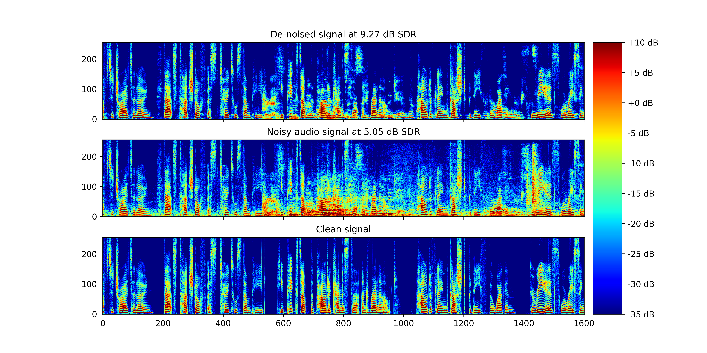

De-noised audio

<audio controls="">
<source src="audio_examples/dns-norev/cvunet-maph/clnsp25_babble_188218_21_snr5_tl-25_fileid_147.wav" type="audio/mpeg"/>
                    Your browser does not support the audio element.
                </audio>

Noisy audio

<audio controls="">
<source src="audio_examples/dns-norev/noisy_fileid_147.wav" type="audio/mpeg"/>
                    Your browser does not support the audio element.
                </audio>

Clean audio

<audio controls="">
<source src="audio_examples/voice-dns-norev/clean_clnsp25_babble_188218_21_snr5_tl-25_fileid_147.wav" type="audio/mpeg"/>
                    Your browser does not support the audio element.
                </audio>

Example of the CVU-Net (Ma/Ph) de-noising on babble noise with a female speaker

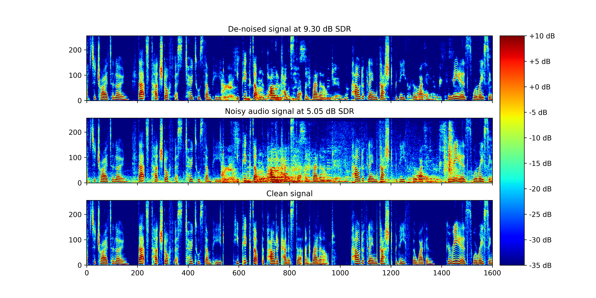

<h4 id="Now-we-look-at-the-exact-same-files,-but-for-the-mismatched-scenario-when-the-models-are-trained-on-VoiceBank+DEMAND-instead">Now we look at the exact same files, but for the mismatched scenario when the models are trained on VoiceBank+DEMAND instead<a class="anchor-link" href="#Now-we-look-at-the-exact-same-files,-but-for-the-mismatched-scenario-when-the-models-are-trained-on-VoiceBank+DEMAND-instead">¶</a></h4>
It is important to note that we use the (Ma/Ph)-model variations primarily because for the sake of comparison here. Listening to the (Re/Im)-variations might improve the listening experience since those models exhibit a slightly larger SDR differences, making these differences somewhat easier to detect by listening. For instance, the first comparison below reveals an SDR difference of 0.85 dB for (Ma/Ph), compared to 0.96 dB for (Re/Im), both favoring the CVU-Net. For another comparison on (Re/Im)-models, the files and figures are also included in this repository.

In [27]:

<pre># Wind noise
# CU-Net
image_path = "audio_examples/voice-dns-norev/cunet-maph/cunet-maph_fileid_170.png"
clean_path = "audio_examples/voice-dns-norev/clean_clnsp205_wind_407027_1_snr1_tl-24_fileid_170.wav"
noisy_path = "audio_examples/dns-norev/noisy_fileid_170.wav"
denoised_path = "audio_examples/voice-dns-norev/cunet-maph/clnsp205_wind_407027_1_snr1_tl-24_fileid_170.wav"
image_title = "Example of the CU-Net (Ma/Ph) de-noising on wind noise with a male speaker"
create_html_display(image_path, clean_path, noisy_path, denoised_path, image_title)

# CVU-Net
image_path = "audio_examples/voice-dns-norev/cvunet-maph/cvunet-maph_fileid_170.png"
denoised_path = "audio_examples/voice-dns-norev/cvunet-maph/clnsp205_wind_407027_1_snr1_tl-24_fileid_170.wav"
image_title = "Example of the CVU-Net (Ma/Ph) de-noising on wind noise with a male speaker"
create_html_display(image_path, clean_path, noisy_path, denoised_path, image_title)

# Vacuum noise female speaker
# CU-Net
image_path = "audio_examples/voice-dns-norev/cunet-maph/cunet-maph_fileid_175.png"
clean_path = "audio_examples/voice-dns-norev/clean_clnsp257_vacuum_273194_2_snr4_tl-18_fileid_175.wav"
noisy_path = "audio_examples/dns-norev/noisy_fileid_175.wav"
denoised_path = "audio_examples/voice-dns-norev/cunet-maph/clnsp257_vacuum_273194_2_snr4_tl-18_fileid_175.wav"
image_title = "Example of the CU-Net (Ma/Ph) de-noising a vacuum cleaner noise with a female speaker"
create_html_display(image_path, clean_path, noisy_path, denoised_path, image_title)

# CVU-Net
image_path = "audio_examples/voice-dns-norev/cvunet-maph/cvunet-maph_fileid_175.png"
denoised_path = denoised_path = "audio_examples/voice-dns-norev/cvunet-maph/clnsp257_vacuum_273194_2_snr4_tl-18_fileid_175.wav"
image_title = "Example of the CVU-Net (Ma/Ph) de-noising a vacuum cleaner noise with a female speaker"
create_html_display(image_path, clean_path, noisy_path, denoised_path, image_title)

# Babble male speaker
# CU-Net
image_path = "audio_examples/voice-dns-norev/cunet-maph/cunet-maph_fileid_255.png"
clean_path = "audio_examples/voice-dns-norev/clean_clnsp50_babble_188218_24_snr4_tl-29_fileid_255.wav"
noisy_path = "audio_examples/dns-norev/noisy_fileid_255.wav"
denoised_path = "audio_examples/voice-dns-norev/cunet-maph/clnsp50_babble_188218_24_snr4_tl-29_fileid_255.wav"
image_title = "Example of the CU-Net (Ma/Ph) de-noising on babble noise with a male speaker"
create_html_display(image_path, clean_path, noisy_path, denoised_path, image_title)

# CVU-Net
image_path = "audio_examples/voice-dns-norev/cvunet-maph/cvunet-maph_fileid_255.png"
denoised_path = "audio_examples/voice-dns-norev/cvunet-maph/clnsp50_babble_188218_24_snr4_tl-29_fileid_255.wav"
image_title = "Example of the CVU-Net (Ma/Ph) de-noising on babble noise with a male speaker"
create_html_display(image_path, clean_path, noisy_path, denoised_path, image_title)

# Babble Female speaker
# CU-Net
image_path = "audio_examples/voice-dns-norev/cunet-maph/cunet-maph_fileid_147.png"
clean_path = "audio_examples/voice-dns-norev/clean_clnsp25_babble_188218_21_snr5_tl-25_fileid_147.wav"
noisy_path = "audio_examples/dns-norev/noisy_fileid_147.wav"
denoised_path = "audio_examples/voice-dns-norev/cunet-maph/clnsp25_babble_188218_21_snr5_tl-25_fileid_147.wav"
image_title = "Example of the CU-Net (Ma/Ph) de-noising on babble noise with a female speaker"
create_html_display(image_path, clean_path, noisy_path, denoised_path, image_title)

# CVU-Net
image_path = "audio_examples/voice-dns-norev/cvunet-maph/cvunet-maph_fileid_147.png"
denoised_path = "audio_examples/voice-dns-norev/cvunet-maph/clnsp25_babble_188218_21_snr5_tl-25_fileid_147.wav"
image_title = "Example of the CVU-Net (Ma/Ph) de-noising on babble noise with a female speaker"
create_html_display(image_path, clean_path, noisy_path, denoised_path, image_title)
</pre>

De-noised audio

<audio controls="">
<source src="audio_examples/voice-dns-norev/cunet-maph/clnsp205_wind_407027_1_snr1_tl-24_fileid_170.wav" type="audio/mpeg"/>
                    Your browser does not support the audio element.
                </audio>

Noisy audio

<audio controls="">
<source src="audio_examples/dns-norev/noisy_fileid_170.wav" type="audio/mpeg"/>
                    Your browser does not support the audio element.
                </audio>

Clean audio

<audio controls="">
<source src="audio_examples/voice-dns-norev/clean_clnsp205_wind_407027_1_snr1_tl-24_fileid_170.wav" type="audio/mpeg"/>
                    Your browser does not support the audio element.
                </audio>

Example of the CU-Net (Ma/Ph) de-noising on wind noise with a male speaker

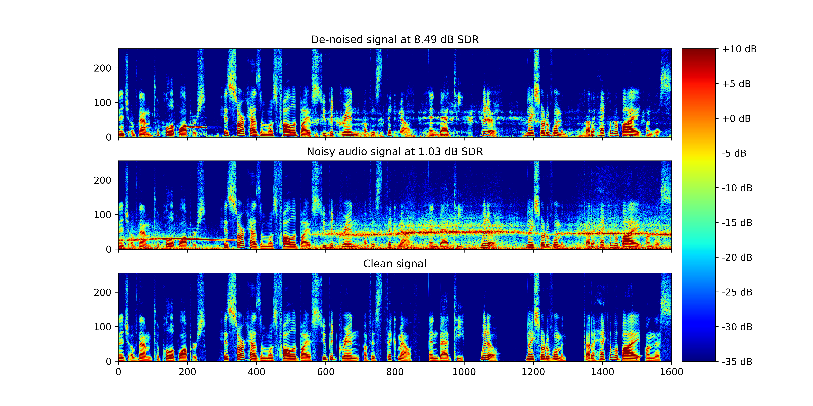

De-noised audio

<audio controls="">
<source src="audio_examples/voice-dns-norev/cvunet-maph/clnsp205_wind_407027_1_snr1_tl-24_fileid_170.wav" type="audio/mpeg"/>
                    Your browser does not support the audio element.
                </audio>

Noisy audio

<audio controls="">
<source src="audio_examples/dns-norev/noisy_fileid_170.wav" type="audio/mpeg"/>
                    Your browser does not support the audio element.
                </audio>

Clean audio

<audio controls="">
<source src="audio_examples/voice-dns-norev/clean_clnsp205_wind_407027_1_snr1_tl-24_fileid_170.wav" type="audio/mpeg"/>
                    Your browser does not support the audio element.
                </audio>

Example of the CVU-Net (Ma/Ph) de-noising on wind noise with a male speaker

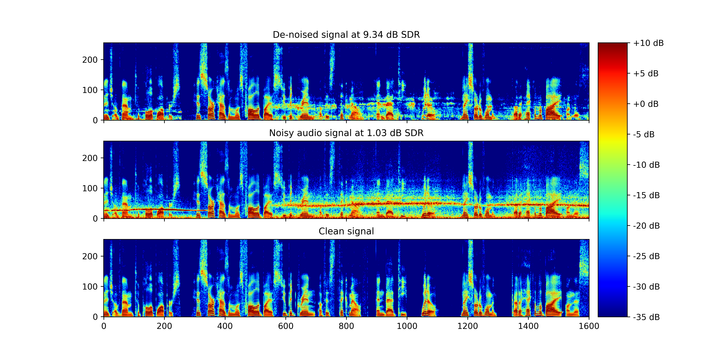

De-noised audio

<audio controls="">
<source src="audio_examples/voice-dns-norev/cunet-maph/clnsp257_vacuum_273194_2_snr4_tl-18_fileid_175.wav" type="audio/mpeg"/>
                    Your browser does not support the audio element.
                </audio>

Noisy audio

<audio controls="">
<source src="audio_examples/dns-norev/noisy_fileid_175.wav" type="audio/mpeg"/>
                    Your browser does not support the audio element.
                </audio>

Clean audio

<audio controls="">
<source src="audio_examples/voice-dns-norev/clean_clnsp257_vacuum_273194_2_snr4_tl-18_fileid_175.wav" type="audio/mpeg"/>
                    Your browser does not support the audio element.
                </audio>

Example of the CU-Net (Ma/Ph) de-noising a vacuum cleaner noise with a female speaker

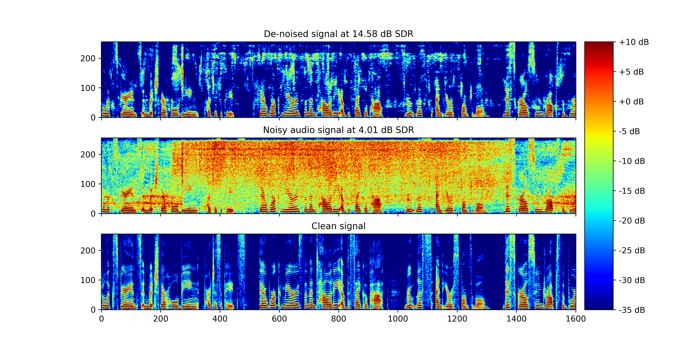

De-noised audio

<audio controls="">
<source src="audio_examples/voice-dns-norev/cvunet-maph/clnsp257_vacuum_273194_2_snr4_tl-18_fileid_175.wav" type="audio/mpeg"/>
                    Your browser does not support the audio element.
                </audio>

Noisy audio

<audio controls="">
<source src="audio_examples/dns-norev/noisy_fileid_175.wav" type="audio/mpeg"/>
                    Your browser does not support the audio element.
                </audio>

Clean audio

<audio controls="">
<source src="audio_examples/voice-dns-norev/clean_clnsp257_vacuum_273194_2_snr4_tl-18_fileid_175.wav" type="audio/mpeg"/>
                    Your browser does not support the audio element.
                </audio>

Example of the CVU-Net (Ma/Ph) de-noising a vacuum cleaner noise with a female speaker

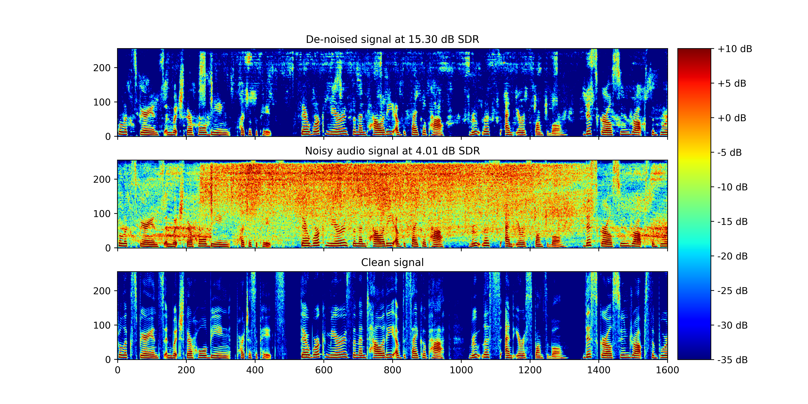

De-noised audio

<audio controls="">
<source src="audio_examples/voice-dns-norev/cunet-maph/clnsp50_babble_188218_24_snr4_tl-29_fileid_255.wav" type="audio/mpeg"/>
                    Your browser does not support the audio element.
                </audio>

Noisy audio

<audio controls="">
<source src="audio_examples/dns-norev/noisy_fileid_255.wav" type="audio/mpeg"/>
                    Your browser does not support the audio element.
                </audio>

Clean audio

<audio controls="">
<source src="audio_examples/voice-dns-norev/clean_clnsp50_babble_188218_24_snr4_tl-29_fileid_255.wav" type="audio/mpeg"/>
                    Your browser does not support the audio element.
                </audio>

Example of the CU-Net (Ma/Ph) de-noising on babble noise with a male speaker

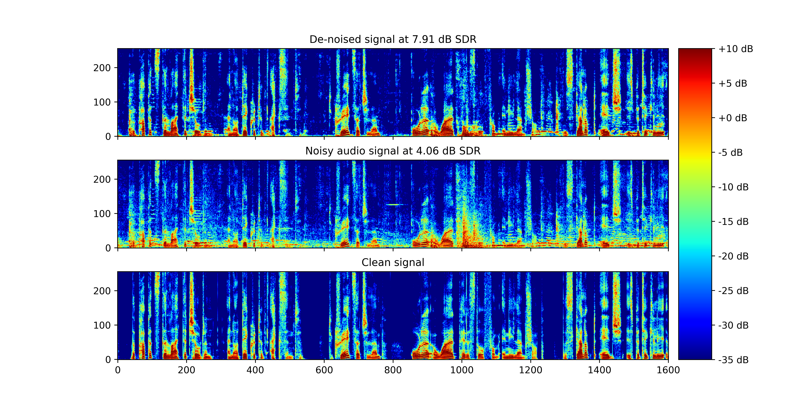

De-noised audio

<audio controls="">
<source src="audio_examples/voice-dns-norev/cvunet-maph/clnsp50_babble_188218_24_snr4_tl-29_fileid_255.wav" type="audio/mpeg"/>
                    Your browser does not support the audio element.
                </audio>

Noisy audio

<audio controls="">
<source src="audio_examples/dns-norev/noisy_fileid_255.wav" type="audio/mpeg"/>
                    Your browser does not support the audio element.
                </audio>

Clean audio

<audio controls="">
<source src="audio_examples/voice-dns-norev/clean_clnsp50_babble_188218_24_snr4_tl-29_fileid_255.wav" type="audio/mpeg"/>
                    Your browser does not support the audio element.
                </audio>

Example of the CVU-Net (Ma/Ph) de-noising on babble noise with a male speaker

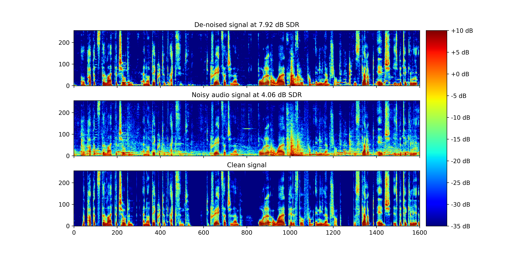

De-noised audio

<audio controls="">
<source src="audio_examples/voice-dns-norev/cunet-maph/clnsp25_babble_188218_21_snr5_tl-25_fileid_147.wav" type="audio/mpeg"/>
                    Your browser does not support the audio element.
                </audio>

Noisy audio

<audio controls="">
<source src="audio_examples/dns-norev/noisy_fileid_147.wav" type="audio/mpeg"/>
                    Your browser does not support the audio element.
                </audio>

Clean audio

<audio controls="">
<source src="audio_examples/voice-dns-norev/clean_clnsp25_babble_188218_21_snr5_tl-25_fileid_147.wav" type="audio/mpeg"/>
                    Your browser does not support the audio element.
                </audio>

Example of the CU-Net (Ma/Ph) de-noising on babble noise with a female speaker

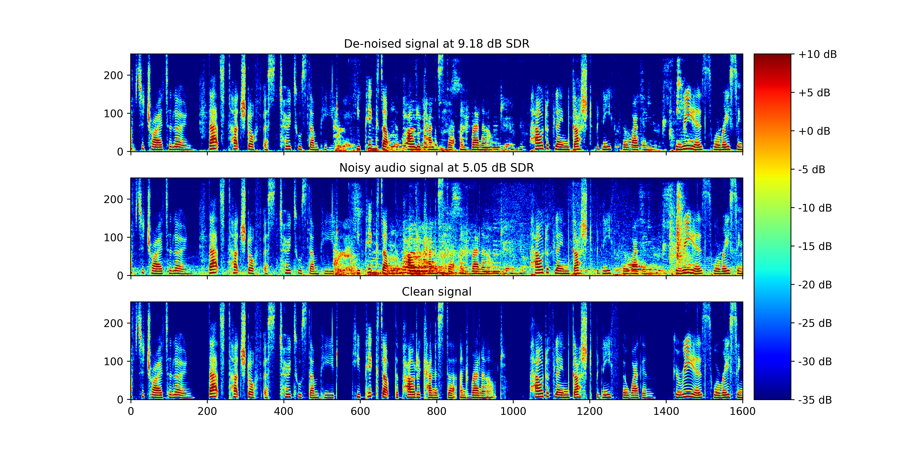

De-noised audio

<audio controls="">
<source src="audio_examples/voice-dns-norev/cvunet-maph/clnsp25_babble_188218_21_snr5_tl-25_fileid_147.wav" type="audio/mpeg"/>
                    Your browser does not support the audio element.
                </audio>

Noisy audio

<audio controls="">
<source src="audio_examples/dns-norev/noisy_fileid_147.wav" type="audio/mpeg"/>
                    Your browser does not support the audio element.
                </audio>

Clean audio

<audio controls="">
<source src="audio_examples/voice-dns-norev/clean_clnsp25_babble_188218_21_snr5_tl-25_fileid_147.wav" type="audio/mpeg"/>
                    Your browser does not support the audio element.
                </audio>

Example of the CVU-Net (Ma/Ph) de-noising on babble noise with a female speaker

<h4 id="Training-on-the-DNS-dataset-and-evaluating-on-VoiceBank+DEMAND">Training on the DNS dataset and evaluating on VoiceBank+DEMAND<a class="anchor-link" href="#Training-on-the-DNS-dataset-and-evaluating-on-VoiceBank+DEMAND">¶</a></h4>

In [30]:

<pre>def create_html_display(image_path, clean_path, noisy_path, denoised_path, image_title):
    # Titles for the audio files and image
    audio_title_1 = 'De-noised audio'
    audio_title_2 = 'Noisy audio'
    audio_title_3 = 'Clean audio'
    image_width = "860px"
    image_height = "auto"
    # Create HTML to display the image and audio files in a column with titles
    html_content = f"""
    &lt;div style="display: flex;"&gt;
        &lt;div style="margin-right: 20px;"&gt;
            &lt;div style="margin-top: 150px;"&gt;
                &lt;p&gt;{audio_title_1}&lt;/p&gt;
                &lt;audio controls&gt;
                    &lt;source src="{denoised_path}" type="audio/mpeg"&gt;
                    Your browser does not support the audio element.
                &lt;/audio&gt;
            &lt;/div&gt;
            &lt;div style="margin-top: 150px;"&gt;
                &lt;p&gt;{audio_title_2}&lt;/p&gt;
                &lt;audio controls&gt;
                    &lt;source src="{noisy_path}" type="audio/mpeg"&gt;
                    Your browser does not support the audio element.
                &lt;/audio&gt;
            &lt;/div&gt;
            &lt;div style="margin-top: 100px;"&gt;
                &lt;p&gt;{audio_title_3}&lt;/p&gt;
                &lt;audio controls&gt;
                    &lt;source src="{clean_path}" type="audio/mpeg"&gt;
                    Your browser does not support the audio element.
                &lt;/audio&gt;
            &lt;/div&gt;
        &lt;/div&gt;
        &lt;div&gt;
            &lt;p style="font-size: 24px;"&gt;{image_title}&lt;/p&gt;
            &lt;img src="{image_path}" alt="Image" style="width: {image_width}; height: {image_height};"&gt;
        &lt;/div&gt;
    &lt;/div&gt;
    """

    # Display the audio files using HTML
    display(HTML(html_content))

# Male speaker with music and rustling noise
# CU-Net
image_path = "audio_examples/dns-to-voice/cunet-maph/cunet-maph_fileidp232_160.png"
clean_path = "audio_examples/dns-to-voice/clean_p232_160.wav"
noisy_path = "audio_examples/dns-to-voice/noisy_p232_160.wav"
denoised_path = "audio_examples/dns-to-voice/cunet-maph/p232_160.wav"
image_title = "CU-Net (Ma/Ph) de-noising for male speaker with music &amp; background noise"
create_html_display(image_path, clean_path, noisy_path, denoised_path, image_title)

# CVU-Net
image_path = "audio_examples/dns-to-voice/cvunet-maph/cvunet-maph_fileidp232_160.png"
clean_path = "audio_examples/dns-to-voice/clean_p232_160.wav"
noisy_path = "audio_examples/dns-to-voice/noisy_p232_160.wav"
denoised_path = "audio_examples/dns-to-voice/cvunet-maph/p232_160.wav"
image_title = "CVU-Net (Ma/Ph) for male speaker with music &amp; background noise"
create_html_display(image_path, clean_path, noisy_path, denoised_path, image_title)

# Female Speaker with music
# CU-Net
image_path = "audio_examples/dns-to-voice/cunet-maph/cunet-maph_fileidp257_430.png"
clean_path = "audio_examples/dns-to-voice/clean_p257_430.wav"
noisy_path = "audio_examples/dns-to-voice/noisy_p257_430.wav"
denoised_path = "audio_examples/dns-to-voice/cunet-maph/p257_430.wav"
image_title = "CU-Net (Ma/Ph) de-noising for female speaker with music"
create_html_display(image_path, clean_path, noisy_path, denoised_path, image_title)

# CVU-Net
image_path = "audio_examples/dns-to-voice/cvunet-maph/cvunet-maph_fileidp257_430.png"
denoised_path = "audio_examples/dns-to-voice/cvunet-maph/p257_430.wav"
image_title = "CVU-Net (Ma/Ph) for female speaker with music noise"
create_html_display(image_path, clean_path, noisy_path, denoised_path, image_title)

# Female Speaker with babble
# CU-Net
image_path = "audio_examples/dns-to-voice/cunet-maph/cunet-maph_fileidp257_411.png"
clean_path = "audio_examples/dns-to-voice/clean_p257_411.wav"
noisy_path = "audio_examples/dns-to-voice/noisy_p257_411.wav"
denoised_path = "audio_examples/dns-to-voice/cunet-maph/p257_411.wav"
image_title = "CU-Net (Ma/Ph) de-noising for female speaker with babble noise"
create_html_display(image_path, clean_path, noisy_path, denoised_path, image_title)

# CVU-Net
image_path = "audio_examples/dns-to-voice/cvunet-maph/cvunet-maph_fileidp257_411.png"
denoised_path = "audio_examples/dns-to-voice/cvunet-maph/p257_411.wav"
image_title = "CVU-Net (Ma/Ph) for female speaker with babble noise"
create_html_display(image_path, clean_path, noisy_path, denoised_path, image_title)
</pre>

De-noised audio

<audio controls="">
<source src="audio_examples/dns-to-voice/cunet-maph/p232_160.wav" type="audio/mpeg"/>
                    Your browser does not support the audio element.
                </audio>

Noisy audio

<audio controls="">
<source src="audio_examples/dns-to-voice/noisy_p232_160.wav" type="audio/mpeg"/>
                    Your browser does not support the audio element.
                </audio>

Clean audio

<audio controls="">
<source src="audio_examples/dns-to-voice/clean_p232_160.wav" type="audio/mpeg"/>
                    Your browser does not support the audio element.
                </audio>

CU-Net (Ma/Ph) de-noising for male speaker with music &amp; background noise

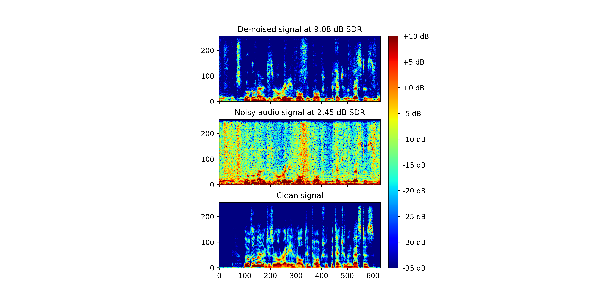

De-noised audio

<audio controls="">
<source src="audio_examples/dns-to-voice/cvunet-maph/p232_160.wav" type="audio/mpeg"/>
                    Your browser does not support the audio element.
                </audio>

Noisy audio

<audio controls="">
<source src="audio_examples/dns-to-voice/noisy_p232_160.wav" type="audio/mpeg"/>
                    Your browser does not support the audio element.
                </audio>

Clean audio

<audio controls="">
<source src="audio_examples/dns-to-voice/clean_p232_160.wav" type="audio/mpeg"/>
                    Your browser does not support the audio element.
                </audio>

CVU-Net (Ma/Ph) for male speaker with music &amp; background noise

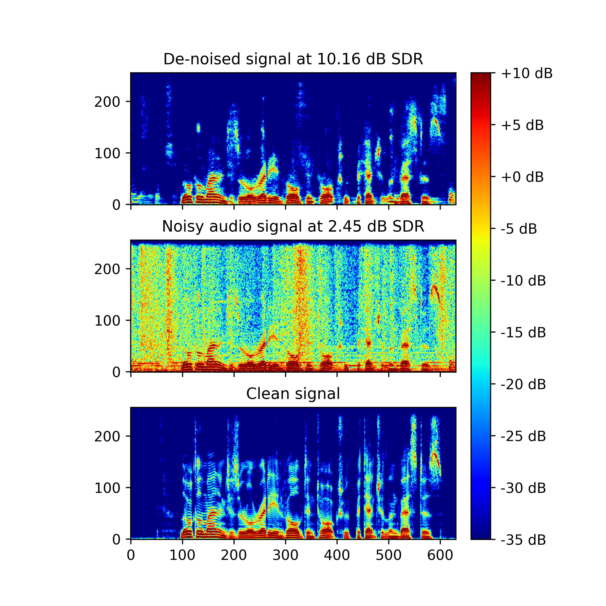

De-noised audio

<audio controls="">
<source src="audio_examples/dns-to-voice/cunet-maph/p257_430.wav" type="audio/mpeg"/>
                    Your browser does not support the audio element.
                </audio>

Noisy audio

<audio controls="">
<source src="audio_examples/dns-to-voice/noisy_p257_430.wav" type="audio/mpeg"/>
                    Your browser does not support the audio element.
                </audio>

Clean audio

<audio controls="">
<source src="audio_examples/dns-to-voice/clean_p257_430.wav" type="audio/mpeg"/>
                    Your browser does not support the audio element.
                </audio>

CU-Net (Ma/Ph) de-noising for female speaker with music

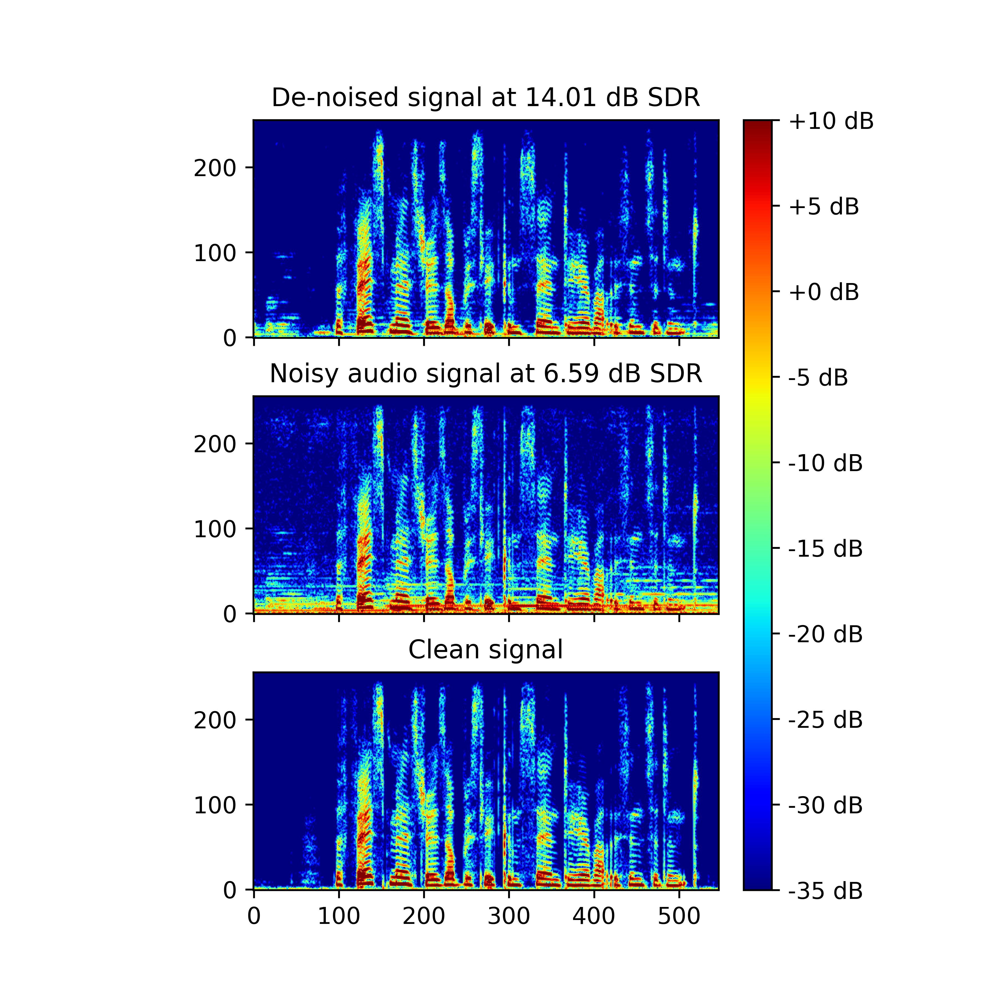

De-noised audio

<audio controls="">
<source src="audio_examples/dns-to-voice/cvunet-maph/p257_430.wav" type="audio/mpeg"/>
                    Your browser does not support the audio element.
                </audio>

Noisy audio

<audio controls="">
<source src="audio_examples/dns-to-voice/noisy_p257_430.wav" type="audio/mpeg"/>
                    Your browser does not support the audio element.
                </audio>

Clean audio

<audio controls="">
<source src="audio_examples/dns-to-voice/clean_p257_430.wav" type="audio/mpeg"/>
                    Your browser does not support the audio element.
                </audio>

CVU-Net (Ma/Ph) for female speaker with music noise

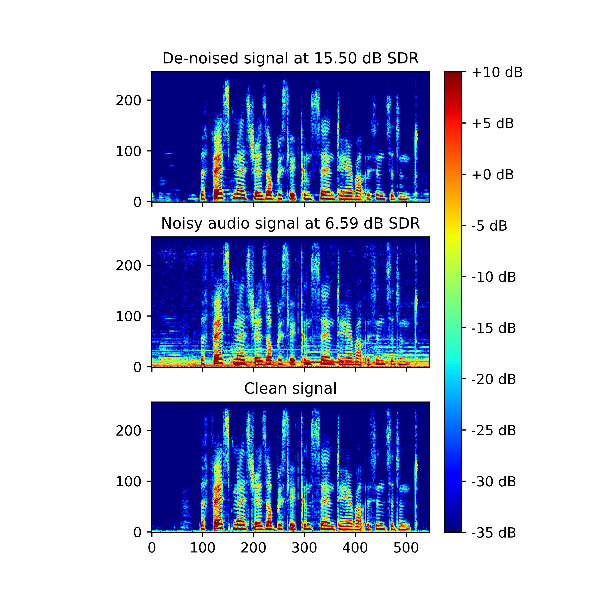

De-noised audio

<audio controls="">
<source src="audio_examples/dns-to-voice/cunet-maph/p257_411.wav" type="audio/mpeg"/>
                    Your browser does not support the audio element.
                </audio>

Noisy audio

<audio controls="">
<source src="audio_examples/dns-to-voice/noisy_p257_411.wav" type="audio/mpeg"/>
                    Your browser does not support the audio element.
                </audio>

Clean audio

<audio controls="">
<source src="audio_examples/dns-to-voice/clean_p257_411.wav" type="audio/mpeg"/>
                    Your browser does not support the audio element.
                </audio>

CU-Net (Ma/Ph) de-noising for female speaker with babble noise

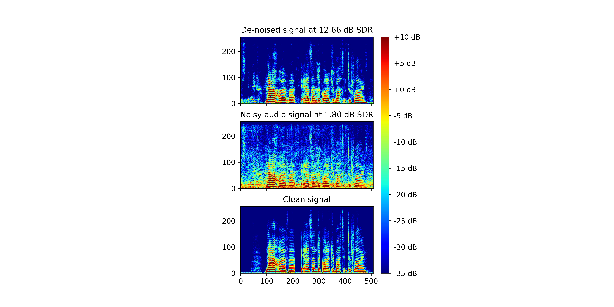

De-noised audio

<audio controls="">
<source src="audio_examples/dns-to-voice/cvunet-maph/p257_411.wav" type="audio/mpeg"/>
                    Your browser does not support the audio element.
                </audio>

Noisy audio

<audio controls="">
<source src="audio_examples/dns-to-voice/noisy_p257_411.wav" type="audio/mpeg"/>
                    Your browser does not support the audio element.
                </audio>

Clean audio

<audio controls="">
<source src="audio_examples/dns-to-voice/clean_p257_411.wav" type="audio/mpeg"/>
                    Your browser does not support the audio element.
                </audio>

CVU-Net (Ma/Ph) for female speaker with babble noise

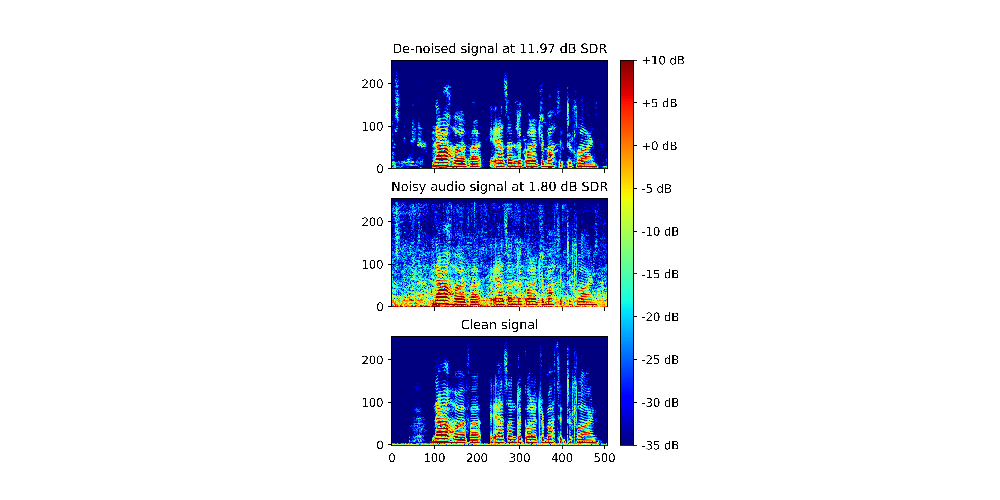

</main>
</body>
</html>
